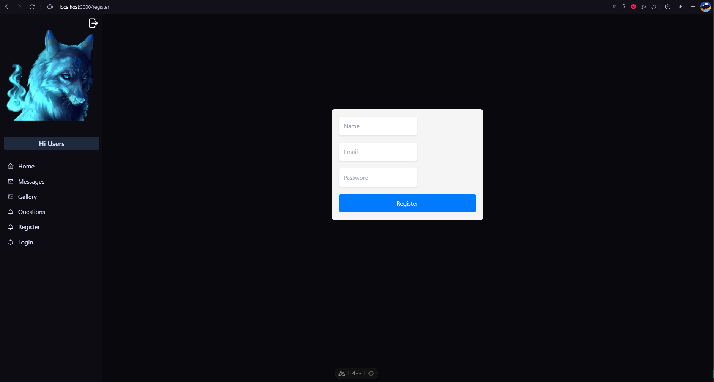
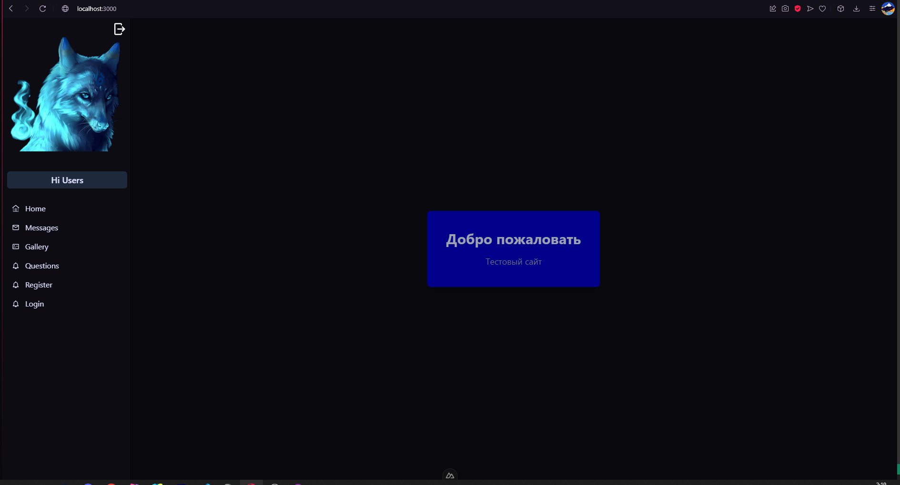
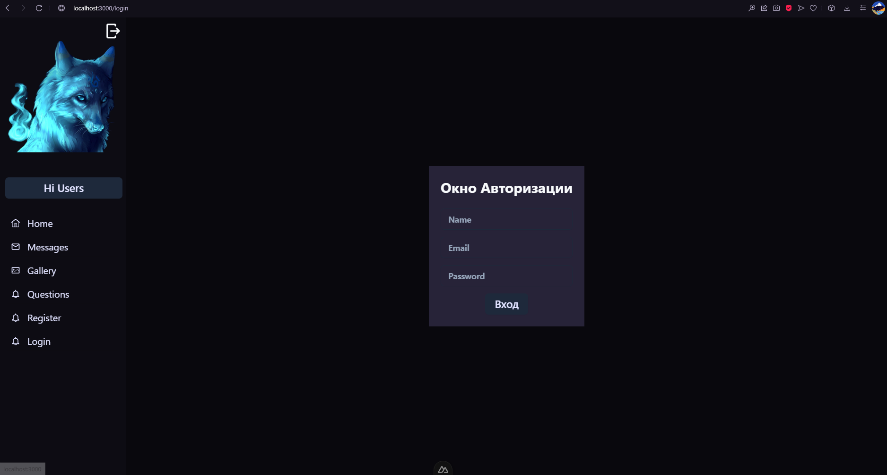
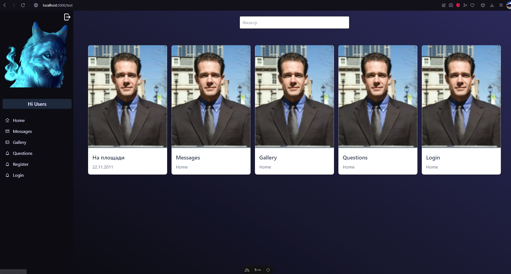

# Тестовый проект

Этот проект представляет собой тестовое приложение, созданное с использованием фреймворка **Nuxt.js**.

## Включенные пакеты:

- **@nuxt/image**: Модуль для оптимизации и обработки изображений.
- **@nuxtjs/tailwindcss**: Интеграция фреймворка стилей **Tailwind CSS**.
- **shadcn-nuxt** и **nuxt-icon**: Модули для работы с иконками.
- **@pinia/nuxt**: Интеграция библиотеки управления состоянием **Pinia**.

## Попытка использования сервисов:

- **Appwrite**: Попытка интеграции Backend-as-a-Service платформы для управления пользователями и данными.
- **MySQL**: Попытка использования реляционной базы данных для хранения данных.

## Функциональность:

**Регистрация**:


**Главная**:


**Вход**:


**Фильтр по карточкам в галерее**



## Использование:

1. Установите зависимости проекта:

```bash
npm install
# или
yarn install
